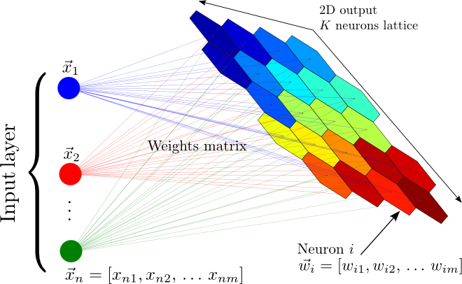

<style>
.list-group-item.active, .list-group-item.active:focus, .list-group-item.active:hover {
    background-color: #6633FF;
}
</style>

```{r setup, include=FALSE, warning=FALSE}
knitr::opts_chunk$set(echo = TRUE)
suppressMessages(library(EBImage))
suppressMessages(library(caret))
suppressMessages(library(dplyr))
suppressMessages(library(tidyr))
suppressMessages(library(kohonen))
suppressMessages(library(ggplot2))
suppressMessages(library(ggcorrplot))
suppressMessages(library(htmlTable))
suppressMessages(library(kableExtra))

```

# Resumen

Los mapas autorganizados de Kohonen son un algoritmo que a partir de un proceso iterativo de comparacion con un conjunto de datos y cambios para aproximarse a los mismos, crea un modelo de esos mismos datos que puede servir para agruparlos por criterios de similitud; adicionalmente, este agrupamiento se produce de forma que la proyeccion de estos datos sobre el mapa distribuya sus caracteristicas de una forma gradual. El Mapa de Kohonen, SOM se usa para diferentes aplicaciones:


- Clustering: se pueden agrupar datos del conjunto de entrada, atendiendo a diferentes criterios.

- Visualizacion: este agrupamiento, como se realiza de una forma ordenada, permite visualizar al conjunto de entrada y descubrir caracteristicas nuevas o relaciones que no se habian previsto de antemano. Tambien permite visualizar la evolucion temporal de un conjunto de datos: proyectando un vector en etapas sucesivas sobre un mapa entrenado se ve como se va moviendo de una zona con unas caracteristicas determinadas a otra.

- Clasificacion: aunque el entrenamiento del mapa no tiene en cuenta la etiqueta de clase o el tipo de cada uno de los vectores de entrada, una vez terminado el entrenamiento se puede asignar algun tipo de etiqueta a cada nodo, y se puede usar para clasificar datos desconocidos.

- Interpolacion de una funcion: asignando valores numericos a cada uno de los nodos de la red de Kohonen, se pueden asignar esos valores numericos a los vectores de entrada: a cada vector (dato) de entrada le correspondera el numero o vector asignados a la salida mas cercana.

- Cuantizacion vectorial: corresponde a la aplicacion de una entrada continua a una salida que esta discretizada, obteniendo a partir de un vector cualquiera el vector mas cercano de un conjunto previamente establecido. 


A continuacion se vera la implementacion de mapas autorganizados para la reduccion dimensional, visualizacion de caracteristicas y clasificacion de imagenes.


# Mapas autorganizados de Kohonen

El algoritmo de SOM (Kohonen, 1982), traducido del ingles mapas auto-organizados, es un  modelo  de  redes  neuronales  de  aprendizaje  no  supervisado  competitivo.  Los modelos de redes neuronales se aplican a problemas de reconocimiento de patrones. Estas redes construyen clases a partir de los datos de entrenamiento no etiquetados $(x1, x2,...xN)$ mediante medidas de disimilitud, y tratan de identificar las particiones optimas (en realidad no se puede asegurar que sean las optimas, pero si seran aceptables) del conjunto de datos de entrada. Las  redes  neuronales  son  competitivas  en  cuanto  a que  las  neuronas  compiten  unas con  otras  por  activarse.  Cuando  se  trabaja  con  redes  neuronales  se  pretende  que cuando  se  presenten  los  datos  de  entrada  al modelo,  este  active  una  (o unas  pocas) neuronas de salida,las cuales se denominaran neuronas vencedoras. El proposito de este  aprendizaje  es  clasificar  los  datos que  se  introducen  en  la  red  y que, cuando  se introduzcan  objetos  que  pertenezcan  a  la  misma  categoria,  estos  activen  la  misma neurona de salida; se debe activar una y solo una. Dichas categorias deben ser creadas por la propia red, puesto que se trata de aprendizaje no supervisado. El objetivo de SOM es representar conjuntos de datos multidimensionales en una red de  menores  dimensiones,  habitualmente  en  un  espacio  bidimensional,  de  forma que dichos datos conserven la topologia inicial; es decir, que aquellos que son proximos en el espacio multidimensional, deben mantenerse proximos en el mapa bidimensional. Las topologias mas frecuentes son la rectangular y la hexagonal; en este trabajo se utiliza la rectangular. 


Un modelo de SOM esta compuesto por dos capas de neuronas. Por un lado, la capa de entrada, formada por $N$ neuronas (una neurona por cada dato de entrada), que se encarga de recibir y transmitir a la capa de salida la informacion procedente del exterior. Por otro lado, la  capa  de  salida,  formada  por $M$  neuronas,  que  es  la  encargada  de procesar   la   informacion,   crear   patrones   e   identificar   las   posibles   categorias. Normalmente, las neuronas de la capa de salida se organizan en un mapa bidimensional como se ha mencionado en el parrafo anterior, tal y como se muestra en la figura.
 
<br> </br>
<center></center>
<br> </br>
<center> Fig 1. Representacion de mapa autorganizado (SOM)</center>
<br> </br>


La transmision entre las dos capas que forman la red es siempre hacia adelante; en otras palabras, la informacion se propaga siempre desde la capa de entrada hacia la capa de salida. Cada neurona de entrada $i$ esta conectada a cada una de las neuronas de salida $j$ mediante un peso $w_{ji}$. De esta forma, las neuronas de  salida  tienen  asociado  un  vector  de  pesos  $w_{j}$,llamado  vector  de  referencia  o *codebook*. Este vector es el vector promedio de la categoria representada por la neurona $j$.

El algoritmo de SOM se divide en cinco etapas:

1. En  la  inicializacion  se  le  asigna  a  cada  uno  de  los  nodos  un  vector  de  pesos aleatorio $w_{j}$.

2. En la segunda etapa, o etapa de competicion, se selecciona, para cada dato de entrada $x_i$,el nodo $j$ al cual es mas proximo en terminos de similitud. Para ello se calcula la distancia euclidea del dato $x_i$ a cada uno de los vectores del *codebook*, y se elige aquella neurona a la cual esta distancia sea minima. A dicha neurona $j$ se le denomina neurona vencedora. 


$$j = argmin \Arrowvert x_i - w_j \Arrowvert^2 \quad\quad (1\leq j\leq M)$$


3. La siguiente etapa es la fase de cooperacion. Una vez terminada la etapa *2*, se vecinos a aquellos nodos $w_k$ cuya distancia a $w_j$ es minima; la funcion que elaciona dicha distancia se llama *tasa de vecindad* ($h=h(l_i-l_k)$). Esta funcion asigna mas o menos peso a los nodos vecinos en funcion de la distancia: cuanto mas proximo, mayor peso y viceversa ($h \in (0, 1)$).


Por otro lado, se define la *tasa de aprendizaje* $\alpha$. Esta depende del numero de iteraciones que se especifican previamente en el argumento de la funcion **SOM** de forma que en cada iteracion, $\alpha$ decrece linealmente desde $1$ hasta $0$ ($\alpha \in (0, 1)$).


4. En  esta etapa  se  actualizan  los  vectores  de  pesos  de  los  nodos  vecinos, conocida como etapa de adaptacion:

$$w_k = w_k + \alpha h(l_i-l_k)(x_i-w_k)$$


5. Se repiten las etapas 2, 3 y 4 hasta que se verifique alguno de los criterios de parada. Dichos criterios de parada pueden ser, bien que se alcance el numero maximo de iteraciones, o que tras varias iteraciones el cambio de vectores de peso no sea significativo.


# Aplicacion I: dataset MNIST
## Carga de datos

MNIST (Instituto Nacional Modificado de Estandares y Tecnologia) es el conjunto de datos de facto de *vision mundial* de la vision de computadora. Desde su lanzamiento en 1999, este clasico conjunto de dato de imagenes manuscritas ha servido como base para los algoritmos de clasificacion de referencia. A medida que surgen nuevas tecnicas de aprendizaje automatico, MNIST sigue siendo un recurso confiable para investigadores y estudiantes por igual.

El conjunto de datos mixto de Instituto Nacional de estandares y tecnologia (MNIST) es una coleccion de 70.000 imagenes de digitos escritos a mano. Los datos fue creados para actuar como un referente para los algoritmos de reconocimiento de imagen. 

Las imagenes son de 28 x 28 pixeles y cuenta con 10 clases posibles, digitos del cero al nueve.


```{r load, cache=TRUE, comment="", echo=TRUE, warning=FALSE, fig.align='center',fig.cap="Fig 2. Primeros 250 digitos escritos a mano"}
train <- read.csv("train.csv")
train$label <- factor(train$label)
train[,c(2:785)] <- round(train[,c(2:785)], digits = 0)

l <- 1
for (i in 1:10) {
      for (k in 1:25) {
            if(k==1){b <- matrix(unlist(train[l,-1])/255, ncol = 28, nrow = 28)}
            if(k>1){
                  a <- matrix(unlist(train[l,-1])/255, ncol = 28, nrow = 28)
                  b <- rbind(b,a) 
            }
            l <- l+1
      }
      if(i==1){
            c <- b
            remove(b)
      }
      if(i>1){
            c <- cbind(c,b)
            remove(b)
      }
}

colors <- colorRampPalette(c("#6633FF","#FFAA44","#BBFF00"))

plot(colormap(c, palette = colors(256)))
# title("Primeros 250 digitos escritos a mano")
```

Al observar el rango de las imagenes tenemos que varia entre `r min(train[,-1])` y `r max(train[,-1])`, por lo que es necesario normalizar los datos para que la red neuronal opere correctamente. Ademas, como se observa en la imagen de muestra, mucho valores (orillas de los numeros) presentan el mismo valor, lo que no entrega informacion util al modelo y puede provocar problemas de colinealidad, para ello eliminaremos los pixeles con varianza cercana a cero. 

Luego, utilizaremos dividiremos el data set en conjunto de entrenamiento y pruebas. Todo lo anterior utilizando la libreria ***caret***

```{r dataSplit, echo=TRUE, fig.align='center', warning=FALSE, cache=TRUE, comment=""}
# train[,-1] <- train[,-1]/255

set.seed(100)
Index <- createDataPartition(y = train$label, p = 0.7, list = FALSE)

preProc <- preProcess(as.matrix(train[Index,-1]), method = c("center", "scale", "nzv"))
trainP <- predict(preProc, as.matrix(train[Index,-1]))
testP <- predict(preProc, as.matrix(train[-Index,-1]))


trainingdata <- list(measurements = trainP, 
                     target = as.matrix(train[Index,1]))
testingdata <- list(measurements = testP, 
                    target = as.matrix(train[-Index,1]))

tb <- data.frame(Muestras = c(nrow(trainingdata$measurements), nrow(testingdata$measurements)))
tb = tb %>% mutate(Porcentaje = round(Muestras*100/sum(Muestras),2))
rownames(tb) <- c("trainset", "testset")
htmlTable(tb,
          caption = "Tabla 1. Conjuntos de entrenamiento y prueba.",
          col.rgroup = c("none","#9999F7"))#6633FF F7F7F7
```


## Entrenamiento del SOM

Con el conjunto de entrenamiento definido vamos a entrenar los SOM, para ello utilizaremos la libreria ***kohonen***, definiendolos siguientes parametros:

```{r somParam, echo=FALSE, fig.align='center', warning=FALSE, cache=TRUE, comment=""}
dim <- 10
rlen <- 100
alpha <- c(0.7, 0.01)
radius <- floor(dim*0.75)
titleFig3 <- paste0("Fig 3. Entrenamiento SOM durante ", rlen, " iteraciones.")
```

- Numero de epocas: `r rlen`
- Alpha: entre `r alpha[1]` y `r alpha[2]`
- Radio: `r radius`
- Grilla: `r dim` x `r dim`
- Topologia: Rectangular

De lo anterior, tenemos que el numero de epocas es la cantidad de veces que pasa el conjunto de entrenamiento por el algoritmo. Alpha es la tasa de aprendizaje que comienza en `r alpha[1]` al inicio y va decreciendo hasta finalizar con `r alpha[2]`. El radio corresponde a la vecindad que se considera al momento de actualizar los pesos, comienza con radio 0 y va aumentando hasta `r radius` al finalizar.

La grilla es la disposicion de la capa de salida, en este caso de `r dim`x`r dim` en topologia rectangular. Esto hace que reduzcamos en un `r 100-round(dim*dim*100/(ncol(train)-1), 2)`% la cantidad de datos de cada imagen.


```{r som, echo=TRUE, fig.align='center', warning=FALSE, cache=TRUE, comment="", fig.cap=titleFig3}

data.SOM <- supersom(trainingdata$measurements, rlen = rlen, alpha = alpha, mode = "pbatch",
                     normalizeDataLayers = FALSE, radius = radius,
                     grid = somgrid(xdim =  dim, ydim =  dim, topo = "rectangular"))

plot(data.SOM, type = "changes", col = "#6633FF", shape = "straight")
```

A continuacion se muestra el codebook del modelo, que refleja como influye cada uno de los `r ncol(train)-1` pixeles a cada una de las neuronas de salida. Se observa que neuronas cercanas tienden a tener distribuciones similares.


```{r codebook, echo=TRUE, fig.align='center', warning=FALSE, cache=TRUE, comment="", fig.cap="Fig 4. Codebook del modelo entrenado."}
plot(data.SOM, type = "codes", codeRendering = "stars", bgcol = colors(500)[seq.int(350,500,1)], shape = "straight")

```


El siguiente grafico muestra el conteo de observaciones mapeadas a cada neurona, esto influye en la capacidad para distinguir entre distintos tipos de observaciones, si hay sectores con muchas conteos de observaciones quiere decir que un gran numero de obsercaciones presentan las mismas caracteristicas, esto podria ser negativo en su caso extremo, ya que si un sector detecta la mayoria de las observaciones no entregaria informacion util para diferenciar clases. Lo mismo ocurre para neuronas sin observaciones (color gris) que no entregarian informacion, ya que su peso seria 0.

Este no es el caso, aunque hay valores maximos, se observan variaciones de color en la figura, lo que representa que hay cierta variabilidad en los datos.


```{r somCount, echo=TRUE, fig.align='center', warning=FALSE, cache=TRUE, comment="", fig.cap="Fig 5. Conteo de observaciones mapeadas por cada neurona."}
plot(data.SOM, type = "counts", palette.name = colors, heatkey = TRUE, shape = "straight")

```


El grafico de distancia entre neuronas vecinas es util para visualizar posibles fronteras entre zonas y tener una idea de donde se agruparian distintos grupos. En la figura se observan por lo menos 3 zonas donde se podian agrupar caracteristica, 2 en los extremos de tono mas oscuro y una separando en la diagonal de tono mas claro.


```{r somNeighbours, echo=TRUE, fig.align='center', warning=FALSE, cache=TRUE, comment="", fig.cap="Fig 6. Distancia entre neuronas vecinas."}
plot(data.SOM, type = "dist.neighbours", palette.name = colors, shape = "straight")

```


La calidad presente en el modelo se puede representar utilizando las distancia de las observaciones al codebook final, mientras menor distancia mejor representacion de las observaciones.


```{r somQuality, echo=TRUE, fig.align='center', warning=FALSE, cache=TRUE, comment="", fig.cap="Fig 7. Distancia entre neuronas vecinas."}
plot(data.SOM, type = "quality", palette.name = colors, heatkey = TRUE, shape = "straight")

```


## Representacion de las clases en el modelo y clasificacion

A continuacion revisaremos como quedan distribuidas las clases (cada numero) en el mapa. Para ello consideraremos el porcentaje de ocurrencia de cada clase por neurona.

Lo anterior se realiza, primero definiendo cual es la neurona del mapa con el mayor valor por observacion, por ejemplo, para la primera observacion la neurona con mayor valor es la 92, por lo que a esta neurona se le asigna el valor del target que en este caso es el numero 1, asi para todas las observaciones. El resultad se puede observar en la siguiente figura.


```{r somPredTable, echo=TRUE, fig.align='center', warning=FALSE, cache=TRUE, comment="", fig.cap="Fig 8. Distribucion de clases por neurona."}
som.prediction <- predict(data.SOM, newdata = trainingdata$measurements)
dist <- table(trainingdata$target, som.prediction$unit.classif)
plot(dist, col = "#6633FF", main = "Numeros")
```


Se observa que cada clase activa neuronas especificas, abora vamos a ver si estas distribuciones estan relacionadas o no y por lo tanto si el mapa es util para extraer caracteristicas de cada clase.

Al realizar la correlacion entre los datos tenemos que los datos generados por el modelo para cada clase no estan correlacionados, lo que es muy util para clasificar.


```{r somPredCor, echo=TRUE, fig.align='center', warning=FALSE, cache=TRUE, comment="", fig.cap="Fig 9. Matriz de correlacion entre representacion de cada numero."}
dist <- dist %>% apply(2, function(x){x/sum(x)})
corDist <- cor(dist %>% t())
row.names(corDist) <- paste0("N", row.names(corDist))
colnames(corDist) <- paste0("N", colnames(corDist))
corDist %>% 
   ggcorrplot(lab = TRUE, 
              colors = colorRampPalette(c("#BBFF00","#6633FF","#BBFF00"))(3),
              legend.title = "Correlation")
```

Ahora observando las zonas del mapa asociada a cada clase tenemos que cada clase se ubica en zonas relativamente diferentes del resto de las clases, esto indica que el modelo separa corectamente las caracteristicas que diferencia a cada clase.

```{r somPredRep, echo=TRUE, fig.align='center', warning=FALSE, cache=TRUE, comment="", fig.cap="Fig 10. Zonas del mapa asociadas a cada clase."}
par(mfrow = c(2,5))

for (j in 1:10) {
  plot(data.SOM, type = "property", property = dist[j,], main=paste0("Number ", j-1, "\n" ),
       palette.name = colors, heatkey = FALSE, shape = "straight")
}

```


Acontinuacion comenzaremos con realizar una clasificacion utilizando el SOM entrenado anteriormente.

Como se observa en la matriz de confusion, los numeros 4 y 9 presentan problemas


```{r somTestClass, echo=TRUE, fig.align='center', warning=FALSE, cache=TRUE, comment=""}
testSOM <- predict(data.SOM, newdata = testingdata$measurements)

testSOMvalue <- testSOM$predictions[[1]] %*% t(testSOM$unit.predictions[[1]])

numberPred <- testSOM$unit.classif %>% sapply(function(x) {which.max(dist[,x])-1})

cm <- confusionMatrix(data = as.factor(numberPred), 
                reference = as.factor(testingdata$target))
cm
```

La clasificacion entrega un valor de *accuracy* igual a `r round(cm$overall[[1]], 4)` y un valor de *kappa* igual a `r round(cm$overall[[2]], 4)` lo que es bastante bueno para ser un modelo no supervisado.


