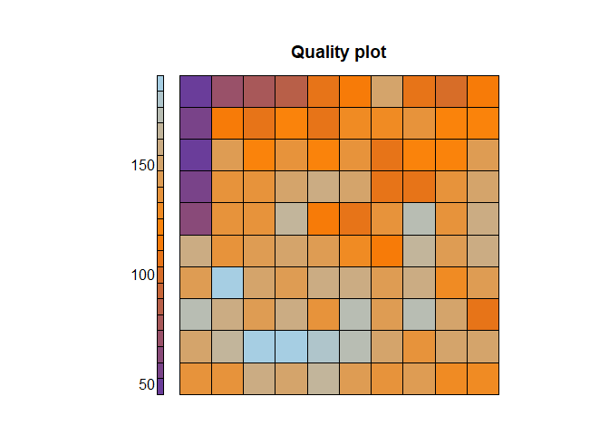
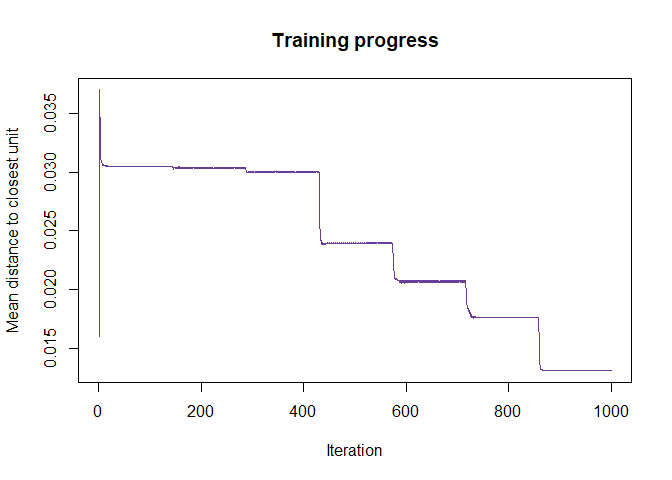
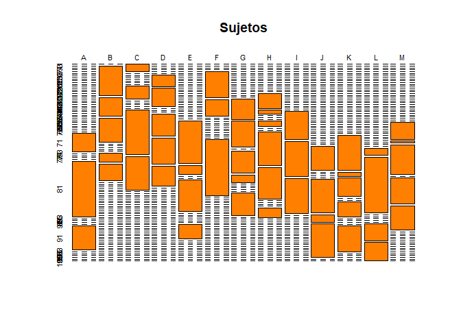
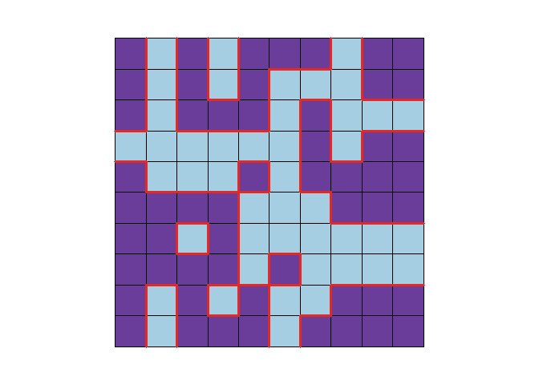

<style>
.list-group-item.active, .list-group-item.active:focus, .list-group-item.active:hover {
    background-color: #6A3D9A;
}
</style>


# Resumen

Los mapas autorganizados de Kohonen son un algoritmo que a partir de un proceso iterativo de comparacion con un conjunto de datos y cambios para aproximarse a los mismos, crea un modelo de esos mismos datos que puede servir para agruparlos por criterios de similitud; adicionalmente, este agrupamiento se produce de forma que la proyeccion de estos datos sobre el mapa distribuya sus caracteristicas de una forma gradual. El Mapa de Kohonen, SOM se usa para diferentes aplicaciones:


- Clustering: se pueden agrupar datos del conjunto de entrada, atendiendo a diferentes criterios.

- Visualizacion: este agrupamiento, como se realiza de una forma ordenada, permite visualizar al conjunto de entrada y descubrir caracteristicas nuevas o relaciones que no se habian previsto de antemano. Tambien permite visualizar la evolucion temporal de un conjunto de datos: proyectando un vector en etapas sucesivas sobre un mapa entrenado se ve como se va moviendo de una zona con unas caracteristicas determinadas a otra.

- Clasificacion: aunque el entrenamiento del mapa no tiene en cuenta la etiqueta de clase o el tipo de cada uno de los vectores de entrada, una vez terminado el entrenamiento se puede asignar algun tipo de etiqueta a cada nodo, y se puede usar para clasificar datos desconocidos.

- Interpolacion de una funcion: asignando valores numericos a cada uno de los nodos de la red de Kohonen, se pueden asignar esos valores numericos a los vectores de entrada: a cada vector (dato) de entrada le correspondera el numero o vector asignados a la salida mas cercana.

- Cuantizacion vectorial: corresponde a la aplicacion de una entrada continua a una salida que esta discretizada, obteniendo a partir de un vector cualquiera el vector mas cercano de un conjunto previamente establecido. 


A continuacion se vera la implementacion de mapas autorganizados para la reduccion dimensional, visualizacion de caracteristicas y clasificacion de imagenes.


# Mapas autorganizados de Kohonen

El algoritmo de SOM (Kohonen, 1982), traducido del ingles mapas auto-organizados, es un  modelo  de  redes  neuronales  de  aprendizaje  no  supervisado  competitivo.  Los modelos de redes neuronales se aplican a problemas de reconocimiento de patrones. Estas redes construyen clases a partir de los datos de entrenamiento no etiquetados $(x1, x2,...xN)$ mediante medidas de disimilitud, y tratan de identificar las particiones optimas (en realidad no se puede asegurar que sean las optimas, pero si seran aceptables) del conjunto de datos de entrada. Las  redes  neuronales  son  competitivas  en  cuanto  a que  las  neuronas  compiten  unas con  otras  por  activarse.  Cuando  se  trabaja  con  redes  neuronales  se  pretende  que cuando  se  presenten  los  datos  de  entrada  al modelo,  este  active  una  (o unas  pocas) neuronas de salida,las cuales se denominaran neuronas vencedoras. El proposito de este  aprendizaje  es  clasificar  los  datos que  se  introducen  en  la  red  y que, cuando  se introduzcan  objetos  que  pertenezcan  a  la  misma  categoria,  estos  activen  la  misma neurona de salida; se debe activar una y solo una. Dichas categorias deben ser creadas por la propia red, puesto que se trata de aprendizaje no supervisado. El objetivo de SOM es representar conjuntos de datos multidimensionales en una red de  menores  dimensiones,  habitualmente  en  un  espacio  bidimensional,  de  forma que dichos datos conserven la topologia inicial; es decir, que aquellos que son proximos en el espacio multidimensional, deben mantenerse proximos en el mapa bidimensional. Las topologias mas frecuentes son la rectangular y la hexagonal; en este trabajo se utiliza la rectangular. 


Un modelo de SOM esta compuesto por dos capas de neuronas. Por un lado, la capa de entrada, formada por $N$ neuronas (una neurona por cada dato de entrada), que se encarga de recibir y transmitir a la capa de salida la informacion procedente del exterior. Por otro lado, la  capa  de  salida,  formada  por $M$  neuronas,  que  es  la  encargada  de procesar   la   informacion,   crear   patrones   e   identificar   las   posibles   categorias. Normalmente, las neuronas de la capa de salida se organizan en un mapa bidimensional como se ha mencionado en el parrafo anterior, tal y como se muestra en la figura.
 
<br> </br>
<center></center>
<br> </br>
<center> Fig 1. Representacion de mapa autorganizado (SOM)</center>
<br> </br>


La transmision entre las dos capas que forman la red es siempre hacia adelante; en otras palabras, la informacion se propaga siempre desde la capa de entrada hacia la capa de salida. Cada neurona de entrada $i$ esta conectada a cada una de las neuronas de salida $j$ mediante un peso $w_{ji}$. De esta forma, las neuronas de  salida  tienen  asociado  un  vector  de  pesos  $w_{j}$,llamado  vector  de  referencia  o *codebook*. Este vector es el vector promedio de la categoria representada por la neurona $j$.

El algoritmo de SOM se divide en cinco etapas:

1. En  la  inicializacion  se  le  asigna  a  cada  uno  de  los  nodos  un  vector  de  pesos aleatorio $w_{j}$.

2. En la segunda etapa, o etapa de competicion, se selecciona, para cada dato de entrada $x_i$,el nodo $j$ al cual es mas proximo en terminos de similitud. Para ello se calcula la distancia euclidea del dato $x_i$ a cada uno de los vectores del *codebook*, y se elige aquella neurona a la cual esta distancia sea minima. A dicha neurona $j$ se le denomina neurona vencedora. 


$$j = argmin \Arrowvert x_i - w_j \Arrowvert^2 \quad\quad (1\leq j\leq M)$$


3. La siguiente etapa es la fase de cooperacion. Una vez terminada la etapa *2*, se vecinos a aquellos nodos $w_k$ cuya distancia a $w_j$ es minima; la funcion que elaciona dicha distancia se llama *tasa de vecindad* ($h=h(l_i-l_k)$). Esta funcion asigna mas o menos peso a los nodos vecinos en funcion de la distancia: cuanto mas proximo, mayor peso y viceversa ($h \in (0, 1)$).


Por otro lado, se define la *tasa de aprendizaje* $\alpha$. Esta depende del numero de iteraciones que se especifican previamente en el argumento de la funcion **SOM** de forma que en cada iteracion, $\alpha$ decrece linealmente desde $1$ hasta $0$ ($\alpha \in (0, 1)$).


4. En  esta etapa  se  actualizan  los  vectores  de  pesos  de  los  nodos  vecinos, conocida como etapa de adaptacion:

$$w_k = w_k + \alpha h(l_i-l_k)(x_i-w_k)$$


5. Se repiten las etapas 2, 3 y 4 hasta que se verifique alguno de los criterios de parada. Dichos criterios de parada pueden ser, bien que se alcance el numero maximo de iteraciones, o que tras varias iteraciones el cambio de vectores de peso no sea significativo.


# Aplicacion I: dataset MNIST
## Carga de datos

MNIST (Instituto Nacional Modificado de Estandares y Tecnologia) es el conjunto de datos de facto de *vision mundial* de la vision de computadora. Desde su lanzamiento en 1999, este clasico conjunto de dato de imagenes manuscritas ha servido como base para los algoritmos de clasificacion de referencia. A medida que surgen nuevas tecnicas de aprendizaje automatico, MNIST sigue siendo un recurso confiable para investigadores y estudiantes por igual.

El conjunto de datos mixto de Instituto Nacional de estandares y tecnologia (MNIST) es una coleccion de 70.000 imagenes de digitos escritos a mano. Los datos fue creados para actuar como un referente para los algoritmos de reconocimiento de imagen. 

Las imagenes son de 28 x 28 pixeles y cuenta con 10 clases posibles, digitos del cero al nueve.


```r
train <- read.csv("train.csv")
train$label <- factor(train$label)
train[,c(2:785)] <- round(train[,c(2:785)], digits = 0)

pegaImag <- function(img, nrow=25, ncol=10, colExcl = 1, dimImg = c(28, 28), random = FALSE, seed = 0){
   if(random){img <- img[sample(c(1:nrow(img)), nrow(img)),]}
   l <- 1
   for (i in 1:ncol) {
      for (k in 1:nrow) {
         if(k==1){b <- matrix(unlist(img[l,-colExcl])/255, ncol = dimImg[2], nrow = dimImg[1])}
         if(k>1){
            a <- matrix(unlist(img[l,-colExcl])/255, ncol = dimImg[2], nrow = dimImg[1])
            b <- rbind(b,a) 
         }
         l <- l+1
      }
      if(i==1){
         c <- b
         remove(b)
      }
      if(i>1){
         c <- cbind(c,b)
         remove(b)
      }
   }
   return(c)
}

c <- pegaImag(train, nrow = 25, ncol = 10, dimImg = c(28, 28), random = FALSE)
colors <- colorRampPalette(brewer.pal(n = 10, name = "Paired")[c(10,8,1)])
plot(colormap(c, palette = colors(256)))
```

<div class="figure" style="text-align: center">

<p class="caption">Fig 2. Primeros 250 digitos escritos a mano</p>
</div>

Al observar el rango de las imagenes tenemos que varia entre 0 y 255, por lo que es necesario normalizar los datos para que la red neuronal opere correctamente. Ademas, como se observa en la imagen de muestra, mucho valores (orillas de los numeros) presentan el mismo valor, lo que no entrega informacion util al modelo y puede provocar problemas de colinealidad, para ello eliminaremos los pixeles con varianza cercana a cero. 

Luego, dividiremos el dataset en conjunto de entrenamiento y pruebas. Con el conjunto de entrenamiento entrenaremos el SOM y visualizaremos las zonas en que se agrupan los distintos numeros. El conjunto de test se utilizara para clasificar. Todo lo anterior utilizando la libreria ***caret***


```r
set.seed(100)
Index <- createDataPartition(y = train$label, p = 0.7, list = FALSE)

preProc <- preProcess(as.matrix(train[Index,-1]), method = c("center", "scale", "nzv"))
trainP <- predict(preProc, as.matrix(train[Index,-1]))
testP <- predict(preProc, as.matrix(train[-Index,-1]))

trainingdata <- list(measurements = trainP, 
                     target = as.matrix(train[Index,1]))
testingdata <- list(measurements = testP, 
                    target = as.matrix(train[-Index,1]))

tb <- data.frame(Muestras = c(nrow(trainingdata$measurements), nrow(testingdata$measurements)))
tb = tb %>% mutate(Porcentaje = round(Muestras*100/sum(Muestras),2))
rownames(tb) <- c("trainset", "testset")
htmlTable(tb,
          caption = "Tabla 1. Conjuntos de entrenamiento y prueba.",
          col.rgroup = c("none",colors(3)[3]))
```

<table class='gmisc_table' style='border-collapse: collapse; margin-top: 1em; margin-bottom: 1em;' >
<thead>
<tr><td colspan='3' style='text-align: left;'>
Tabla 1. Conjuntos de entrenamiento y prueba.</td></tr>
<tr>
<th style='border-bottom: 1px solid grey; border-top: 2px solid grey;'> </th>
<th style='border-bottom: 1px solid grey; border-top: 2px solid grey; text-align: center;'>Muestras</th>
<th style='border-bottom: 1px solid grey; border-top: 2px solid grey; text-align: center;'>Porcentaje</th>
</tr>
</thead>
<tbody>
<tr>
<td style='text-align: left;'>trainset</td>
<td style='text-align: center;'>29404</td>
<td style='text-align: center;'>70.01</td>
</tr>
<tr style='background-color: #a6cee3;'>
<td style='background-color: #a6cee3; border-bottom: 2px solid grey; text-align: left;'>testset</td>
<td style='background-color: #a6cee3; border-bottom: 2px solid grey; text-align: center;'>12596</td>
<td style='background-color: #a6cee3; border-bottom: 2px solid grey; text-align: center;'>29.99</td>
</tr>
</tbody>
</table>


## Entrenamiento del SOM

Con el conjunto de entrenamiento definido vamos a entrenar los SOM, para ello utilizaremos la libreria ***kohonen***, definiendo los siguientes parametros:


- Numero de epocas: 100
- Alpha: entre 0.7 y 0.01
- Radio: 7
- Grilla: 10 x 10
- Topologia: Rectangular

De lo anterior, tenemos que el numero de epocas es la cantidad de veces que pasa el conjunto de entrenamiento por el algoritmo. ***Alpha*** es la tasa de aprendizaje que comienza en 0.7 al inicio y va decreciendo hasta finalizar con 0.01 de manera lineal. El ***radio*** corresponde a la vecindad que se considera al momento de actualizar los pesos, comienza con radio 0 y va aumentando hasta 7 al finalizar.

La ***grilla*** es la disposicion de la capa de salida, en este caso de 10x10 en topologia rectangular. Esto hace que reduzcamos en un 87.24% la cantidad de datos de cada imagen.


```r
set.seed(0)
data.SOM <- supersom(trainingdata$measurements, rlen = rlen, alpha = alpha, mode = "pbatch",
                     normalizeDataLayers = FALSE, radius = radius,
                     grid = somgrid(xdim =  dim, ydim =  dim, topo = "rectangular"))

plot(data.SOM, type = "changes", col = "#6A3D9A", shape = "straight")
```

<div class="figure" style="text-align: center">

<p class="caption">Fig 3. Entrenamiento SOM durante 100 iteraciones.</p>
</div>

A continuacion (Fig 4) se muestra el codebook del modelo, que refleja como influye cada uno de los 784 pixeles a cada una de las neuronas de salida. Se observa que neuronas cercanas tienden a tener distribuciones similares.


```r
plot(data.SOM, type = "codes", codeRendering = "stars", bgcol = colors(10)[10], shape = "straight")
```

<div class="figure" style="text-align: center">

<p class="caption">Fig 4. Codebook del modelo entrenado.</p>
</div>


El siguiente grafico (Fig 5) muestra el conteo de observaciones mapeadas a cada neurona, esto influye en la capacidad para distinguir entre distintos tipos de observaciones, si hay sectores con muchas conteos de observaciones quiere decir que un gran numero de obsercaciones presentan las mismas caracteristicas, esto podria ser negativo en su caso extremo, ya que si un sector detecta la mayoria de las observaciones no entregaria informacion util para diferenciar clases. Lo mismo ocurre para neuronas sin observaciones (color gris) que no entregarian informacion.

Este no es el caso, aunque hay valores maximos, se observan variaciones de color en la figura, lo que representa que hay cierta variabilidad en los datos.


```r
plot(data.SOM, type = "counts", palette.name = colors, heatkey = TRUE, shape = "straight")
```

<div class="figure" style="text-align: center">

<p class="caption">Fig 5. Conteo de observaciones mapeadas por cada neurona.</p>
</div>


El grafico de distancia entre neuronas vecinas (Fig 6) es util para visualizar posibles fronteras entre zonas y tener una idea de donde se agruparian distintos grupos. Estos grupos son calculados durante el entrenamiento y no tienen que ver con las clases definidas, ya que el entrenamiento es no supervisado.

Donde exista un cambio brusco de tonalidad es posible que exista una frontera.


```r
plot(data.SOM, type = "dist.neighbours", palette.name = colors, shape = "straight")
```

<div class="figure" style="text-align: center">

<p class="caption">Fig 6. Distancia entre neuronas vecinas.</p>
</div>


La calidad presente en el modelo (Fig 7) se puede representar utilizando las distancia de las observaciones al codebook final, mientras menor distancia mejor representacion de las observaciones.


```r
plot(data.SOM, type = "quality", palette.name = colors, heatkey = TRUE, shape = "straight")
```

<div class="figure" style="text-align: center">

<p class="caption">Fig 7. Distancia entre neuronas vecinas.</p>
</div>

## Representacion de las clases en el modelo y clasificacion

A continuacion revisaremos como quedan distribuidas las clases (cada numero) en el mapa. Para ello consideraremos el porcentaje de ocurrencia de cada clase por neurona.

Lo anterior se realiza, primero definiendo cual es la neurona del mapa con el mayor valor por observacion, por ejemplo, para la primera observacion la neurona con mayor valor es la 92, por lo que a esta neurona se le asigna el valor del target que en este caso es el numero 1, asi para todas las observaciones. El resultado se puede observar en la siguiente figura (Fig 9).


```r
som.prediction <- predict(data.SOM, newdata = trainingdata$measurements)
dist <- table(trainingdata$target, som.prediction$unit.classif)
plot(dist, col = colors(3)[2], main = "Numeros")
```

<div class="figure" style="text-align: center">

<p class="caption">Fig 9. Distribucion de clases por neurona.</p>
</div>


Se observa que cada clase activa neuronas especificas, ahora vamos a ver si estas distribuciones estan relacionadas o no y por lo tanto si el mapa es util para extraer caracteristicas que diferencien cada clase.


```r
dist <- dist %>% apply(2, function(x){x/sum(x)})
corDist <- cor(dist %>% t())
row.names(corDist) <- paste0("N", row.names(corDist))
colnames(corDist) <- paste0("N", colnames(corDist))
corDist %>% 
   ggcorrplot(lab = TRUE, 
              colors = colorRampPalette(c(colors(3)[3], colors(3)[1], colors(3)[3]))(3),
              legend.title = "Correlation")
```

<div class="figure" style="text-align: center">

<p class="caption">Fig 10. Matriz de correlacion entre representacion de cada numero.</p>
</div>

Al realizar la correlacion entre los datos tenemos que los datos generados por el modelo para cada clase no estan correlacionados, lo que es muy util para clasificar. Los numeros con mayor correlacion son el 4 y el 9 con una correlacion 0.253.


Ahora observando las zonas del mapa (Fig 11) asociada a cada clase tenemos que cada clase se ubica en zonas relativamente diferentes del resto de las clases, esto indica que el modelo separa las caracteristicas que diferencian a cada clase. 


```r
par(mfrow = c(2,5))

for (j in 1:10) {
  plot(data.SOM, type = "property", property = dist[j,], main=paste0("Numero ", j-1, "\n" ),
       palette.name = colors, heatkey = FALSE, shape = "straight")
}
```

<div class="figure" style="text-align: center">

<p class="caption">Fig 11. Zonas del mapa asociadas a cada clase.</p>
</div>

Si observamos (Fig 12) la desviacion estandar de cada neurona por clase tenemos algunas zonas conflictivas.

Para entender esta figura es necesario tener presente que el color morado representa una desviacion maxima y a medida que se acerca al celeste (pasando por naranjo) se acerca a 0.

Las neuronas con menor desviacion por clase se muestran en tonos naranjo y celestes, estas representan zonas difusas donde se ubican caracteristicas mas generales y pueden pertenecer a varias clases, por lo que genera desviacion menor entre clases.

En este caso particular las zonas con baja desviacion estan asociadas por un lado una zona grande del 9 y el 4, donde hasta un ser humano podria tener problemas en diferenciar; por otro en una zona menor asociada al 3, 5 y 8, numeros que tabien podrian llegar a ser confundidos.


```r
distSd <- dist %>% apply(2, sd)

par(mfrow = c(1,1))
plot(data.SOM, type = "property", property = distSd, main=paste0(""),
     palette.name = colorRampPalette(c(colors(3)[3], colors(3)[2], colors(3)[1])), heatkey = FALSE, shape = "straight")
```

<div class="figure" style="text-align: center">

<p class="caption">Fig 12. Desviacion de representacion de clases por neurona.
</p>
</div>


Con esto ya podemos realizar una clasificacion utilizando el SOM entrenado anteriormente y el conjunto de pruebas definido.


```r
testSOM <- predict(data.SOM, newdata = testingdata$measurements)

testSOMvalue <- testSOM$predictions[[1]] %*% t(testSOM$unit.predictions[[1]])

numberPred <- testSOM$unit.classif %>% sapply(function(x) {which.max(dist[,x])-1})

cm <- confusionMatrix(data = as.factor(numberPred), 
                reference = as.factor(testingdata$target))
cm
```

```
Confusion Matrix and Statistics

          Reference
Prediction    0    1    2    3    4    5    6    7    8    9
         0 1165    0   12   20    0   30   30    2    3    6
         1    0 1366   16    2    9    3    2   13    6    5
         2   18    5 1117   21   23   36   31   31   18   14
         3    4   15   23 1047    0  150    1    1   51   11
         4    2    1    4    1  867    8    1   26   12  174
         5   20    2    1   82    4  859    5    3   92   12
         6   25    2   11    4   20   20 1168    0    8    3
         7    2    2   32   16   11    2    0 1130    7   43
         8    3    6   37   95    1   16    3   10  999   12
         9    0    6    0   17  286   14    0  104   22  976

Overall Statistics
                                          
               Accuracy : 0.849           
                 95% CI : (0.8426, 0.8552)
    No Information Rate : 0.1115          
    P-Value [Acc > NIR] : < 2.2e-16       
                                          
                  Kappa : 0.8322          
                                          
 Mcnemar's Test P-Value : NA              

Statistics by Class:

                     Class: 0 Class: 1 Class: 2 Class: 3 Class: 4 Class: 5
Sensitivity           0.94027   0.9722  0.89146  0.80230  0.71007  0.75483
Specificity           0.99093   0.9950  0.98263  0.97733  0.97987  0.98071
Pos Pred Value        0.91877   0.9606  0.85008  0.80353  0.79106  0.79537
Neg Pred Value        0.99347   0.9965  0.98795  0.97715  0.96922  0.97577
Prevalence            0.09836   0.1115  0.09948  0.10360  0.09694  0.09035
Detection Rate        0.09249   0.1084  0.08868  0.08312  0.06883  0.06820
Detection Prevalence  0.10067   0.1129  0.10432  0.10345  0.08701  0.08574
Balanced Accuracy     0.96560   0.9836  0.93705  0.88981  0.84497  0.86777
                     Class: 6 Class: 7 Class: 8 Class: 9
Sensitivity           0.94118  0.85606  0.82020  0.77707
Specificity           0.99181  0.98980  0.98392  0.96041
Pos Pred Value        0.92625  0.90763  0.84518  0.68491
Neg Pred Value        0.99356  0.98326  0.98081  0.97494
Prevalence            0.09852  0.10480  0.09670  0.09971
Detection Rate        0.09273  0.08971  0.07931  0.07748
Detection Prevalence  0.10011  0.09884  0.09384  0.11313
Balanced Accuracy     0.96649  0.92293  0.90206  0.86874
```

Como se observa en la matriz de confusion, los numeros 4 y 9 presentan algunos problemas, asi como el 3 y el 8 con el numero 5. Estos numeros corresponden a las zonas conflictivas de la figura 12.

De todas maneras la clasificacion entrega un valor de *accuracy* igual a 0.849 y un valor de *kappa* igual a 0.8322 lo que es bastante bueno para ser un modelo no supervisado.


## Representacion y clasificacion de numeros pares

Como los mapas autoorganizados mapean las caracteristicas de los datos de manera no supervisada, es posible utilizar el modelo para agrupar de distintas maneras, en este caso utilizaremos el modelo ya entrenado para visualizar y clasificar numeros pares e impares.

Para ello primero debemos redefinir el *target*.


```r
label <- train$label %>% as.character() %>% as.numeric()
label2 <- 1 - (label %% 2)

tb <- data.frame(Target = head(label,10), TargetNew = head(label2,10))
htmlTable(tb,
          caption = "Tabla 2. Equivalencia numero con paridad.",
          col.rgroup = c("none",colors(3)[3]))
```

<table class='gmisc_table' style='border-collapse: collapse; margin-top: 1em; margin-bottom: 1em;' >
<thead>
<tr><td colspan='3' style='text-align: left;'>
Tabla 2. Equivalencia numero con paridad.</td></tr>
<tr>
<th style='border-bottom: 1px solid grey; border-top: 2px solid grey;'> </th>
<th style='border-bottom: 1px solid grey; border-top: 2px solid grey; text-align: center;'>Target</th>
<th style='border-bottom: 1px solid grey; border-top: 2px solid grey; text-align: center;'>TargetNew</th>
</tr>
</thead>
<tbody>
<tr>
<td style='text-align: left;'>1</td>
<td style='text-align: center;'>1</td>
<td style='text-align: center;'>0</td>
</tr>
<tr style='background-color: #a6cee3;'>
<td style='background-color: #a6cee3; text-align: left;'>2</td>
<td style='background-color: #a6cee3; text-align: center;'>0</td>
<td style='background-color: #a6cee3; text-align: center;'>1</td>
</tr>
<tr>
<td style='text-align: left;'>3</td>
<td style='text-align: center;'>1</td>
<td style='text-align: center;'>0</td>
</tr>
<tr style='background-color: #a6cee3;'>
<td style='background-color: #a6cee3; text-align: left;'>4</td>
<td style='background-color: #a6cee3; text-align: center;'>4</td>
<td style='background-color: #a6cee3; text-align: center;'>1</td>
</tr>
<tr>
<td style='text-align: left;'>5</td>
<td style='text-align: center;'>0</td>
<td style='text-align: center;'>1</td>
</tr>
<tr style='background-color: #a6cee3;'>
<td style='background-color: #a6cee3; text-align: left;'>6</td>
<td style='background-color: #a6cee3; text-align: center;'>0</td>
<td style='background-color: #a6cee3; text-align: center;'>1</td>
</tr>
<tr>
<td style='text-align: left;'>7</td>
<td style='text-align: center;'>7</td>
<td style='text-align: center;'>0</td>
</tr>
<tr style='background-color: #a6cee3;'>
<td style='background-color: #a6cee3; text-align: left;'>8</td>
<td style='background-color: #a6cee3; text-align: center;'>3</td>
<td style='background-color: #a6cee3; text-align: center;'>0</td>
</tr>
<tr>
<td style='text-align: left;'>9</td>
<td style='text-align: center;'>5</td>
<td style='text-align: center;'>0</td>
</tr>
<tr style='background-color: #a6cee3;'>
<td style='background-color: #a6cee3; border-bottom: 2px solid grey; text-align: left;'>10</td>
<td style='background-color: #a6cee3; border-bottom: 2px solid grey; text-align: center;'>3</td>
<td style='background-color: #a6cee3; border-bottom: 2px solid grey; text-align: center;'>0</td>
</tr>
</tbody>
</table>


Ahora veremos como quedan distribuidas cada clase nueva por neurona. En la figura 13 se observa que hay una clara diferenciacion entre representacion de numeros pares e impares.


```r
som.prediction <- predict(data.SOM, newdata = trainingdata$measurements)
dist2 <- table(label2[Index], som.prediction$unit.classif)
dist2 <- dist2 %>% apply(2, function(x){x/sum(x)})

par(mfrow = c(1,2))
tParc = c("Impar", "Par")
for (j in 1:2) {
  plot(data.SOM, type = "property", property = dist2[j,], main=paste0(tParc[j], "\n" ),
       palette.name = colors, heatkey = FALSE, shape = "straight")
}
```

<div class="figure" style="text-align: center">

<p class="caption">Fig 13. Zonas del mapa asociadas a cada clase.</p>
</div>


De todas maneras hay zonas conflictivas (Fig 14), esto es debido a que las zonas conflictivas son intrinsecas al modelo y para poder evitarlas seria necesario aislar todas esas zonas en un grupos aparte, por ejemplo hacer que 4 y 9 sea un grupo, 3, 5 y 8 sea otro grupo, y el resto de numeros grupos aparte, ya que los numeros indicados anteriormente comparten caracteristicas asociadas a este mapa.


```r
dist2Sd <- dist2 %>% apply(2, sd)

par(mfrow = c(1,1))
plot(data.SOM, type = "property", property = dist2Sd, main=paste0(""),
     palette.name = colorRampPalette(c(colors(3)[3], colors(3)[2], colors(3)[1])), 
     heatkey = FALSE, shape = "straight")
```

<div class="figure" style="text-align: center">

<p class="caption">Fig 14. Desviacion de representacion de clases por neurona.</p>
</div>


```r
ParPred <- testSOM$unit.classif %>% sapply(function(x) {which.max(dist2[,x])-1})

cm2 <- confusionMatrix(data = as.factor(ParPred), reference = as.factor(label2[-Index]))
cm2
```

```
Confusion Matrix and Statistics

          Reference
Prediction    0    1
         0 5881  594
         1  543 5578
                                          
               Accuracy : 0.9097          
                 95% CI : (0.9046, 0.9147)
    No Information Rate : 0.51            
    P-Value [Acc > NIR] : <2e-16          
                                          
                  Kappa : 0.8194          
                                          
 Mcnemar's Test P-Value : 0.1381          
                                          
            Sensitivity : 0.9155          
            Specificity : 0.9038          
         Pos Pred Value : 0.9083          
         Neg Pred Value : 0.9113          
             Prevalence : 0.5100          
         Detection Rate : 0.4669          
   Detection Prevalence : 0.5141          
      Balanced Accuracy : 0.9096          
                                          
       'Positive' Class : 0               
                                          
```

La matriz de confusion entrega un valor de *accuracy* igual a 0.849 y un valor de *kappa* igual a 0.8322 lo que es bastante bueno para ser un modelo no supervisado. Ademas, el *balanced accuracy* es similar al *accuracy* por lo que respecto al balence de clases el resultado es confiable.


# Aplicacion II: dataset Face Expression
## Carga de datos

Esta es una base de datos del *Advanced Multimedia Processing (AMP) Lab* de la *Cornell University*, consta de 13 sujetos con 75 imagenes cada sujeto, de 64x64 pixeles en escala de grises, que muestran diferentes expresiones faciales.

Estas imagenes faciales se recopilaron bajo la misma condicion de iluminacion utilizando una camara CCD. Las imagenes de los rostros fueron registradas por la ubicacion de los ojos. 

En la figua 15 se muestran rostros alreatorios de cada uno de los sujetos de esta base de datos.


```r
dir = "faceExpressionDatabase/"
listImage <- list.files(path = dir, pattern = ".bmp$")

faceExp <- listImage %>% 
      sapply(function(x){cbind(label = x %>% substr(1,1), 
                               rotate(read.bitmap(paste0(dir, x),".bmp"), angle = 90) %>% 
                                     matrix(nrow = 1))}) %>% t()

faceExp <- data.frame(faceExp, stringsAsFactors = FALSE, row.names = NULL)
colnames(faceExp)[1] <- "label"
colnames(faceExp)[2:ncol(faceExp)] <- paste0("pixel", c(2:ncol(faceExp))-2)
faceExp[,2:ncol(faceExp)] <- faceExp[,2:ncol(faceExp)] %>% sapply(as.numeric)

idxFE <- seq.int(1,60,12) %>% sapply(function(x){x+75*c(0:12)}) %>% matrix(ncol = 1)

cFE <- pegaImag(faceExp[idxFE,], nrow = 13, ncol = 5, dimImg = c(64, 64), random = FALSE)
plot(Image(cFE))
```

<div class="figure" style="text-align: center">

<p class="caption">Fig 15. Muestras aleatorias (50) del dataset face expression</p>
</div>


Al igual que con el dataset anterior se procede a preprocesar las imagenes, normalizando y eliminando los pixeles con varianza cercana a 0, aunque en este caso los rotros ocupan toda la imagen por lo que la varianza es mayor a 0 en la mayoria de los pixeles. Luego se divide el dataset en entrenamiento y pruebas con una razon 70%/30%.


```r
set.seed(100)
Index <- createDataPartition(y = faceExp$label, p = 0.7, list = FALSE)

preProc <- preProcess(as.matrix(faceExp[Index,-1]), method = c("center", "scale", "nzv"))
trainP <- predict(preProc, as.matrix(faceExp[Index,-1]))
testP <- predict(preProc, as.matrix(faceExp[-Index,-1]))


trainingdata <- list(measurements = trainP, 
                     target = as.matrix(faceExp[Index,1]))
testingdata <- list(measurements = testP, 
                    target = as.matrix(faceExp[-Index,1]))

tb <- data.frame(Muestras = c(nrow(trainingdata$measurements), nrow(testingdata$measurements)))
tb = tb %>% mutate(Porcentaje = round(Muestras*100/sum(Muestras),2))
rownames(tb) <- c("trainset", "testset")
htmlTable(tb,
          caption = "Tabla 3. Conjuntos de entrenamiento y prueba.",
          col.rgroup = c("none",colors(3)[3]))
```

<table class='gmisc_table' style='border-collapse: collapse; margin-top: 1em; margin-bottom: 1em;' >
<thead>
<tr><td colspan='3' style='text-align: left;'>
Tabla 3. Conjuntos de entrenamiento y prueba.</td></tr>
<tr>
<th style='border-bottom: 1px solid grey; border-top: 2px solid grey;'> </th>
<th style='border-bottom: 1px solid grey; border-top: 2px solid grey; text-align: center;'>Muestras</th>
<th style='border-bottom: 1px solid grey; border-top: 2px solid grey; text-align: center;'>Porcentaje</th>
</tr>
</thead>
<tbody>
<tr>
<td style='text-align: left;'>trainset</td>
<td style='text-align: center;'>689</td>
<td style='text-align: center;'>70.67</td>
</tr>
<tr style='background-color: #a6cee3;'>
<td style='background-color: #a6cee3; border-bottom: 2px solid grey; text-align: left;'>testset</td>
<td style='background-color: #a6cee3; border-bottom: 2px solid grey; text-align: center;'>286</td>
<td style='background-color: #a6cee3; border-bottom: 2px solid grey; text-align: center;'>29.33</td>
</tr>
</tbody>
</table>

## Entrenamiento del SOM

Con el conjunto de entrenamiento definido vamos a entrenar los SOM definiendo los siguientes parametros:


- Numero de epocas: 1000
- Alpha: entre 0.95 y 0.01
- Radio: 7
- Grilla: 10 x 10
- Topologia: Rectangular

El numero de epocas para este dataset es 1000, esto es debido a que hay solo 689 observaciones para el entrenamiento.  La tasa de aprendizaje ***Alpha***  comienza en 0.95 al inicio y va decreciendo hasta finalizar con 0.01 de manera lineal. El ***Radio*** varia desde 0 y va aumentando hasta 7 al finalizar el entrenamiento.

La ***grilla*** es la disposicion de la capa de salida, en este caso de 10x10 en topologia rectangular. Esto hace que reduzcamos en un 97.56% la cantidad de datos de cada imagen. Un valor bastante considerable.


```r
set.seed(0)
data.SOM <- supersom(trainingdata$measurements, rlen = rlen, alpha = alpha, mode = "pbatch",
                     normalizeDataLayers = FALSE, radius = radius,
                     grid = somgrid(xdim =  dim, ydim =  dim, topo = "rectangular"))

plot(data.SOM, type = "changes", col = "#6A3D9A", shape = "straight")
```

<div class="figure" style="text-align: center">

<p class="caption">Fig 16. Entrenamiento SOM durante 1000 iteraciones.</p>
</div>

En la figura 17 se muestra el codebook del modelo, que refleja como influye cada uno de los 4096 pixeles a cada una de las neuronas de salida. Se observa que neuronas cercanas tienden a tener distribuciones similares.


```r
plot(data.SOM, type = "codes", codeRendering = "stars", bgcol = colors(10)[10], shape = "straight")
```

<div class="figure" style="text-align: center">

<p class="caption">Fig 17. Codebook del modelo entrenado.</p>
</div>

La figura 18 muestra el conteo de observaciones mapeadas a cada neurona, se observa bastante variabilidad en el conteo lo que es positivo, ya que el modelo agrupa caracteristicas en zonas diferentes. 

Ademas se observan muchos espacios sin conteo (en gris), esto hace que estos pixeles no aporten informacion al modelo y no deben ser considerados en los analisis posteriores.


```r
plot(data.SOM, type = "counts", palette.name = colors, heatkey = TRUE, shape = "straight")
```

<div class="figure" style="text-align: center">

<p class="caption">Fig 18. Conteo de observaciones mapeadas por cada neurona.</p>
</div>

El grafico de distancias (Fig 19) muestra varias zonas diferentes, aunque es necesario revisarlo con mayor detalle, ya que al existir muchas zonas sin conteo, la informacion puede no ser representativa.


```r
plot(data.SOM, type = "dist.neighbours", palette.name = colors, shape = "straight")
```

<div class="figure" style="text-align: center">

<p class="caption">Fig 19. Distancia entre neuronas vecinas.</p>
</div>


La calidad presente en el modelo (Fig 20) presenta valores bajos para la mayoria de las neuronas, por lo que si puede agrupar distintas caracteristicas.


```r
plot(data.SOM, type = "quality", palette.name = colors, heatkey = TRUE, shape = "straight")
```

<div class="figure" style="text-align: center">

<p class="caption">Fig 20. Distancia entre neuronas vecinas.</p>
</div>


## Representacion de las clases en el modelo y clasificacion

A continuacion revisaremos como quedan distribuidas las clases (sujetos) en el mapa. Para ello consideraremos el porcentaje de ocurrencia de cada clase por neurona, al igual que en el caso anteior.

En este caso se puede observar que todo el rango de neuronas tiene una categoria, esto es debido a que en un inicio se le dio un peso aleatorio, por lo que estan mas cercanas a alguna clase y en la etapa de cooperacion del algoritmo si fueron modificadas.


```r
som.prediction <- predict(data.SOM, newdata = trainingdata$measurements)
dist <- table(trainingdata$target, som.prediction$unit.classif)
plot(dist, col = colors(3)[2], main = "Sujetos")
```

<div class="figure" style="text-align: center">

<p class="caption">Fig 22. Distribucion de clases por neurona.</p>
</div>

En la figura 23 tenemos la correlacion entre clases, se observa una muy baja correlacion entrelas distintas clases, incluso menor que con los digitos escritos a mano.


```r
dist <- dist %>% apply(2, function(x){x/sum(x)})
corDist <- cor(dist %>% t())
row.names(corDist) <- paste0("", row.names(corDist))
colnames(corDist) <- paste0("", colnames(corDist))
corDist %>% 
   ggcorrplot(lab = TRUE, 
              colors = colorRampPalette(c(colors(3)[3], colors(3)[1], colors(3)[3]))(3),
              legend.title = "Correlacion")
```

<div class="figure" style="text-align: center">

<p class="caption">Fig 23. Matriz de correlacion entre representacion de cada numero.</p>
</div>

Ahora observando las zonas del mapa (Fig 24) asociada a cada clase tenemos que se ubican en zonas muy diferentes del resto, por lo que se podria predecir una buena clasificacion de sujetos. 


```r
par(mfrow = c(3,5))

for (j in 1:13) {
  plot(data.SOM, type = "property", property = dist[j,], main=paste0("Subject ", LETTERS[j]),
       palette.name = colorRampPalette(colors(13)), heatkey = FALSE, shape = "straight")
}
```

<div class="figure" style="text-align: center">

<p class="caption">Fig 24. Zonas del mapa asociadas a cada clase.</p>
</div>

En la figura 25 tenemos la desviacion de clases y se observan zonas mas claras asociadas a problemas de discriminacion entre clases. 

En este caso estan asociadas a las neuronas donde no hay conteos (zona con frontera roja) por lo que no estan asociadas directamente a alguna clase. La zona util, donde se representa la informacion de las clases esta en morado, lo que representa una alta variabilidad.


```r
colors2 <- colorRampPalette(brewer.pal(n = 10, name = "Paired"))

col0 <- c(1:(dim*dim))[-unique(som.prediction$unit.classif)]
if(length(col0)){
   dist <- cbind(dist, matrix(0, nrow = nrow(dist), ncol = length(col0)))
   colnames(dist)[(ncol(dist) - length(col0) + 1):ncol(dist)] <- col0
}
dist <- dist[,order(as.numeric(colnames(dist)))]

distSd <- dist %>% apply(2, sd)
border <- c(1:(dim*dim)) %>% sapply(function(x){ifelse(sum(x==col0)>0,1,0)})

par(mfrow = c(1,1))
plot(data.SOM, type = "property", property = distSd, main="",
     palette.name = colorRampPalette(c(colors(3)[3], colors(3)[2], colors(3)[1])),
     heatkey = FALSE, shape = "straight")
add.cluster.boundaries(data.SOM, border, col = colors2(24)[14], lwd = 3)
```

<div class="figure" style="text-align: center">

<p class="caption">Fig 25. Desviacion de representacion de clases por neurona.
</p>
</div>


```r
testSOM <- predict(data.SOM, newdata = testingdata$measurements)

testPredTest <- testSOM$unit.classif %>% sapply(function(x) {which.max(dist[,x])[[1]]})
testPredTest <- LETTERS[testPredTest]

cm <- confusionMatrix(data = as.factor(testPredTest), reference = as.factor(testingdata$target))
cm
```

```
Confusion Matrix and Statistics

          Reference
Prediction  A  B  C  D  E  F  G  H  I  J  K  L  M
         A 22  1  0  0  1  0  0  0  0  0  0  0  0
         B  0 21  0  0  0  0  0  0  0  0  0  0  0
         C  0  0 22  0  0  0  0  0  0  0  0  0  0
         D  0  0  0 22  0  0  0  0  0  0  0  0  0
         E  0  0  0  0 16  0  0  0  0  0  0  0  0
         F  0  0  0  0  0 22  0  0  0  0  0  0  0
         G  0  0  0  0  0  0 22  0  0  0  0  0  0
         H  0  0  0  0  0  0  0 22  0  0  0  0  0
         I  0  0  0  0  0  0  0  0 22  0  0  0  0
         J  0  0  0  0  0  0  0  0  0 22  0  0  0
         K  0  0  0  0  0  0  0  0  0  0 22  0  0
         L  0  0  0  0  0  0  0  0  0  0  0 22  0
         M  0  0  0  0  5  0  0  0  0  0  0  0 22

Overall Statistics
                                          
               Accuracy : 0.9755          
                 95% CI : (0.9502, 0.9901)
    No Information Rate : 0.0769          
    P-Value [Acc > NIR] : < 2.2e-16       
                                          
                  Kappa : 0.9735          
                                          
 Mcnemar's Test P-Value : NA              

Statistics by Class:

                     Class: A Class: B Class: C Class: D Class: E Class: F
Sensitivity           1.00000  0.95455  1.00000  1.00000  0.72727  1.00000
Specificity           0.99242  1.00000  1.00000  1.00000  1.00000  1.00000
Pos Pred Value        0.91667  1.00000  1.00000  1.00000  1.00000  1.00000
Neg Pred Value        1.00000  0.99623  1.00000  1.00000  0.97778  1.00000
Prevalence            0.07692  0.07692  0.07692  0.07692  0.07692  0.07692
Detection Rate        0.07692  0.07343  0.07692  0.07692  0.05594  0.07692
Detection Prevalence  0.08392  0.07343  0.07692  0.07692  0.05594  0.07692
Balanced Accuracy     0.99621  0.97727  1.00000  1.00000  0.86364  1.00000
                     Class: G Class: H Class: I Class: J Class: K Class: L
Sensitivity           1.00000  1.00000  1.00000  1.00000  1.00000  1.00000
Specificity           1.00000  1.00000  1.00000  1.00000  1.00000  1.00000
Pos Pred Value        1.00000  1.00000  1.00000  1.00000  1.00000  1.00000
Neg Pred Value        1.00000  1.00000  1.00000  1.00000  1.00000  1.00000
Prevalence            0.07692  0.07692  0.07692  0.07692  0.07692  0.07692
Detection Rate        0.07692  0.07692  0.07692  0.07692  0.07692  0.07692
Detection Prevalence  0.07692  0.07692  0.07692  0.07692  0.07692  0.07692
Balanced Accuracy     1.00000  1.00000  1.00000  1.00000  1.00000  1.00000
                     Class: M
Sensitivity           1.00000
Specificity           0.98106
Pos Pred Value        0.81481
Neg Pred Value        1.00000
Prevalence            0.07692
Detection Rate        0.07692
Detection Prevalence  0.09441
Balanced Accuracy     0.99053
```

La clasificacion entrega un valor de *accuracy* igual a 0.9755 y un valor de *kappa* igual a 0.9735 lo que es muy bueno.


## Representacion y clasificacion de rostros felices

A continuacion evaluaremos el modelo para clasificar rostros felices. Lo primero es definir que es un rostro feliz y en este caso fue mi apreciacion subjetiva (Fig 26).


```r
num2codFace <- function(y){sapply(y, function(x) ifelse(x<10, paste0("0",x), paste0(x)))}

faceHappy <- list("A"=c(3,16:27) %>% num2codFace(),
                  "B"=c(2,4,50:52) %>% num2codFace(),
                  "C"=c(3,52:62) %>% num2codFace(),
                  "D"=c(1,4,14:32,71:74) %>% num2codFace(),
                  "E"=c(1,19:32) %>% num2codFace(),
                  "F"=c(1,4,23:33,67:74) %>% num2codFace(),
                  "G"=c(1,24:40) %>% num2codFace(),
                  "H"=c(1,21:31) %>% num2codFace(),
                  "I"=c(1,26:35) %>% num2codFace(),
                  "J"=c(1,59:72) %>% num2codFace(),
                  "K"=c(3,64:74) %>% num2codFace(),
                  "L"=c(3,52:63) %>% num2codFace(),
                  "M"=c(3,54:63) %>% num2codFace())

label2 <- listImage %>% 
      sapply(function(x){label = sum(faceHappy[[substr(x,1,1)]] == substr(x,2,3))})

cFEhappy <- pegaImag(faceExp[which(label2==1)[sample.int(100,30)],], 
                     nrow = 6, ncol = 5, dimImg = c(64, 64), random = FALSE)
cFEnohappy <- pegaImag(faceExp[which(label2==0)[sample.int(100,30)],], 
                     nrow = 6, ncol = 5, dimImg = c(64, 64), random = FALSE)

par(mfrow = c(1,2))
plot(Image(cFEhappy))
text(labels = "Rostros felices", x = 192, y = -16)
# abline(v = 384, col = colors(3)[1])
segments(x0 = 385, y0 = 3, x1 = 385, y1 = 318, col = colors(3)[1], lwd = 5)
plot(Image(cFEnohappy))
text(labels = "Rostros no felices", x = 192, y = -16)
```

<div class="figure" style="text-align: center">

<p class="caption">Fig 26. Nueva clasificacion de rostros.
</p>
</div>


Ahora veremos como quedan distribuidas cada clase nueva por neurona. 

En la figura 27 se observa que la mayoria de las neuronas estan asociadas a los rostros no felices, esto es debido a que el modelo utilizado fue entrenado con todo el conjunto de datos y en el hay varias expresiones, de las cuales la felicidad es solo una.

No modificaremos esto, ya que la idea principal es evaluar como se comporta el mismo modelo para diferenciar en este tipo de casos.


```r
som.prediction <- predict(data.SOM, newdata = trainingdata$measurements)
dist2 <- table(label2[Index], som.prediction$unit.classif)
dist2 <- dist2 %>% apply(2, function(x){x/sum(x)})

tParc = c("No feliz", "Feliz")
par(mfrow = c(1,2))
for (j in 1:2) {
  plot(data.SOM, type = "property", property = dist2[j,], main=paste0(tParc[j], "\n" ),
       palette.name = colors, heatkey = FALSE, shape = "straight")
  add.cluster.boundaries(data.SOM, border, col = colors2(24)[14], lwd = 3)
}
```

<div class="figure" style="text-align: center">

<p class="caption">Fig 27. Zonas del mapa asociadas a cada clase.</p>
</div>

En este caso tenemos que existen neuronas (Fig 28) que tienen baja variabilidad entre clases y no pertencen a la zona que noaporta informacion. Esto puede traer problemas a la hora de discriminar las clases, ya que ademas tenemos el problema del balaenceo de las clases.


```r
col0 <- c(1:(dim*dim))[-unique(som.prediction$unit.classif)]
if(length(col0)){
   dist2 <- cbind(dist2, matrix(0, nrow = nrow(dist2), ncol = length(col0)))
   colnames(dist2)[(ncol(dist2) - length(col0) + 1):ncol(dist2)] <- col0
}
dist2 <- dist2[,order(as.numeric(colnames(dist2)))]

dist2Sd <- dist2 %>% apply(2, sd)

par(mfrow = c(1,1))
plot(data.SOM, type = "property", property = dist2Sd, main=paste0(""),
     palette.name = colorRampPalette(c(colors(3)[3], colors(3)[2], colors(3)[1])), 
     heatkey = FALSE, shape = "straight")
add.cluster.boundaries(data.SOM, border, col = colors2(24)[14], lwd = 3)
```

<div class="figure" style="text-align: center">

<p class="caption">Fig 28. Desviacion de representacion de clases por neurona.</p>
</div>


```r
testSOM <- predict(data.SOM, newdata = testingdata$measurements)
ExpHappyPred <- testSOM$unit.classif %>% sapply(function(x) {which.max(dist2[,x])-1})

cm2 <- confusionMatrix(data = as.factor(ExpHappyPred), reference = as.factor(label2[-Index]))
cm2
```

```
Confusion Matrix and Statistics

          Reference
Prediction   0   1
         0 224  20
         1   9  33
                                         
               Accuracy : 0.8986         
                 95% CI : (0.8576, 0.931)
    No Information Rate : 0.8147         
    P-Value [Acc > NIR] : 6.7e-05        
                                         
                  Kappa : 0.6349         
                                         
 Mcnemar's Test P-Value : 0.06332        
                                         
            Sensitivity : 0.9614         
            Specificity : 0.6226         
         Pos Pred Value : 0.9180         
         Neg Pred Value : 0.7857         
             Prevalence : 0.8147         
         Detection Rate : 0.7832         
   Detection Prevalence : 0.8531         
      Balanced Accuracy : 0.7920         
                                         
       'Positive' Class : 0              
                                         
```


La matriz de confusion entrega un valor de *accuracy* igual a 0.8986 y un valor de *kappa* igual a 0.6349. 

El resultado del *accuracy* puede causar malas interpretaciones, ya que es bastante bueno y sobre todo comparado con el valor de *kappa*. Es necesario recordar que las clases estan desbalanceadas (las nuevas clases), por lo que una mejor metrica seria considerar el *balanced accuracy* que en este caso es 0.792.


## Referencias.

- Codigo: https://github.com/desareca/SOM-MINST-Clasification

# Sesion Info


```r
sessionInfo()
```

```
R version 4.0.0 (2020-04-24)
Platform: x86_64-w64-mingw32/x64 (64-bit)
Running under: Windows 10 x64 (build 18363)

Matrix products: default

locale:
[1] LC_COLLATE=Spanish_Chile.1252  LC_CTYPE=Spanish_Chile.1252   
[3] LC_MONETARY=Spanish_Chile.1252 LC_NUMERIC=C                  
[5] LC_TIME=Spanish_Chile.1252    

attached base packages:
[1] stats     graphics  grDevices utils     datasets  methods   base     

other attached packages:
 [1] readbitmap_0.1.5   RColorBrewer_1.1-2 kableExtra_1.1.0   htmlTable_1.13.3  
 [5] ggcorrplot_0.1.3   kohonen_3.0.10     tidyr_1.0.3        dplyr_0.8.5       
 [9] caret_6.0-86       ggplot2_3.3.0      lattice_0.20-41    EBImage_4.29.2    

loaded via a namespace (and not attached):
 [1] httr_1.4.1           viridisLite_0.3.0    splines_4.0.0       
 [4] foreach_1.5.0        prodlim_2019.11.13   assertthat_0.2.1    
 [7] stats4_4.0.0         tiff_0.1-5           yaml_2.2.1          
[10] ipred_0.9-9          pillar_1.4.4         backports_1.1.6     
[13] glue_1.4.1           pROC_1.16.2          digest_0.6.25       
[16] checkmate_2.0.0      rvest_0.3.5          colorspace_1.4-1    
[19] recipes_0.1.12       htmltools_0.4.0      Matrix_1.2-18       
[22] plyr_1.8.6           timeDate_3043.102    pkgconfig_2.0.3     
[25] purrr_0.3.4          fftwtools_0.9-8      scales_1.1.1        
[28] webshot_0.5.2        jpeg_0.1-8.1         gower_0.2.1         
[31] lava_1.6.7           tibble_3.0.1         generics_0.0.2      
[34] ellipsis_0.3.1       withr_2.2.0          nnet_7.3-13         
[37] BiocGenerics_0.34.0  survival_3.1-12      magrittr_1.5        
[40] crayon_1.3.4         evaluate_0.14        nlme_3.1-147        
[43] MASS_7.3-51.5        xml2_1.3.2           class_7.3-16        
[46] tools_4.0.0          data.table_1.12.8    bmp_0.3             
[49] hms_0.5.3            lifecycle_0.2.0      stringr_1.4.0       
[52] munsell_0.5.0        locfit_1.5-9.4       compiler_4.0.0      
[55] rlang_0.4.6          grid_4.0.0           RCurl_1.98-1.2      
[58] iterators_1.0.12     rstudioapi_0.11      htmlwidgets_1.5.1   
[61] bitops_1.0-6         rmarkdown_2.1        gtable_0.3.0        
[64] ModelMetrics_1.2.2.2 codetools_0.2-16     abind_1.4-5         
[67] reshape2_1.4.4       R6_2.4.1             lubridate_1.7.8     
[70] knitr_1.28           readr_1.3.1          stringi_1.4.6       
[73] parallel_4.0.0       Rcpp_1.0.4.6         vctrs_0.3.0         
[76] rpart_4.1-15         png_0.1-7            tidyselect_1.1.0    
[79] xfun_0.14           
```


